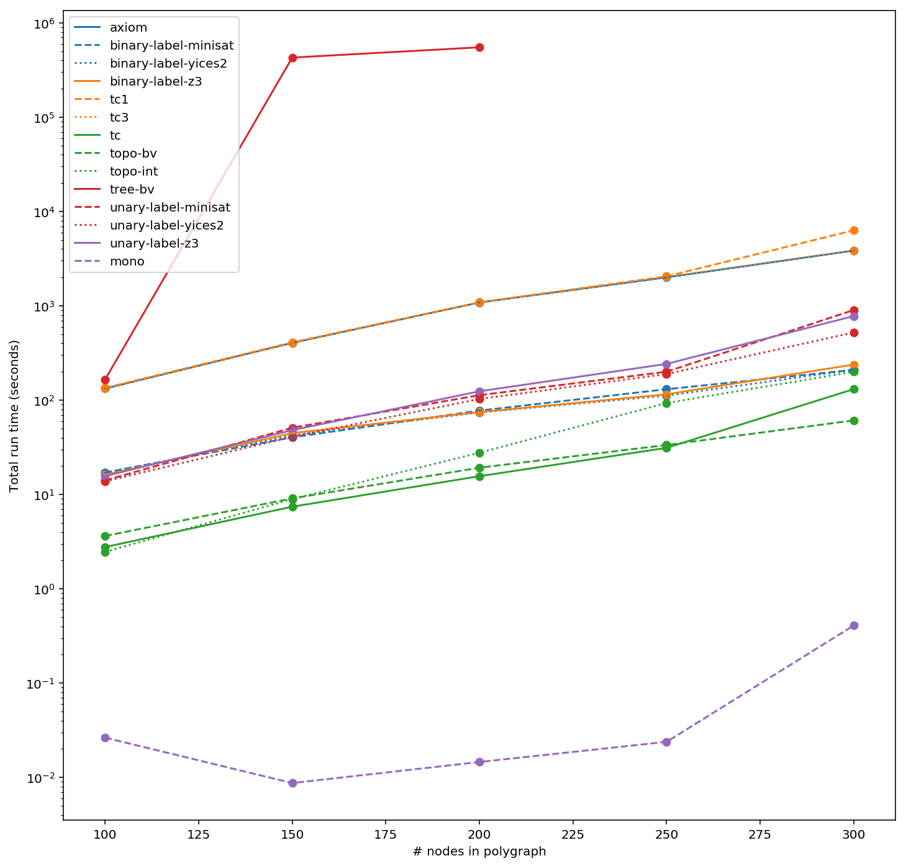
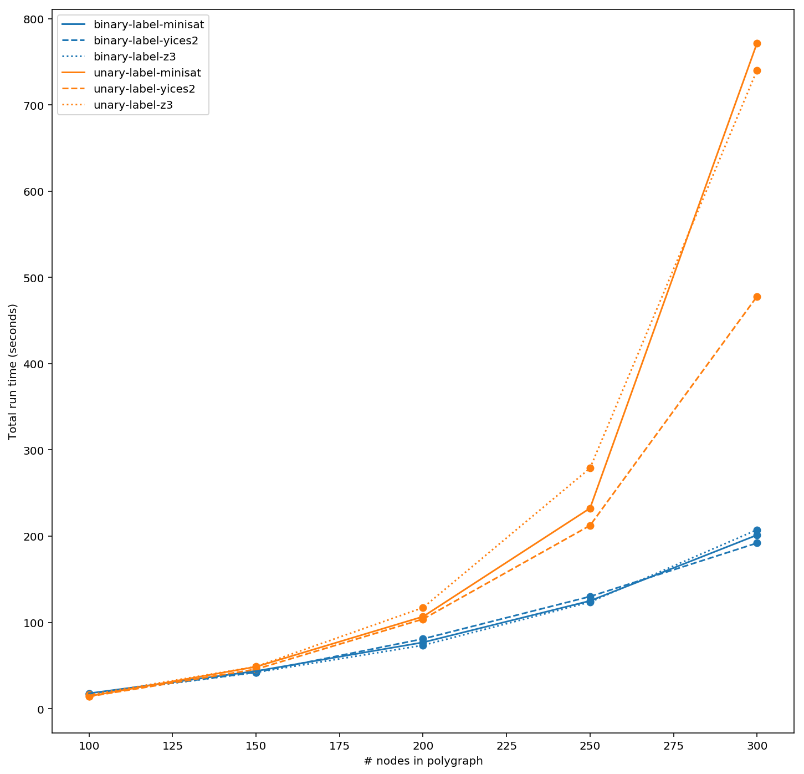
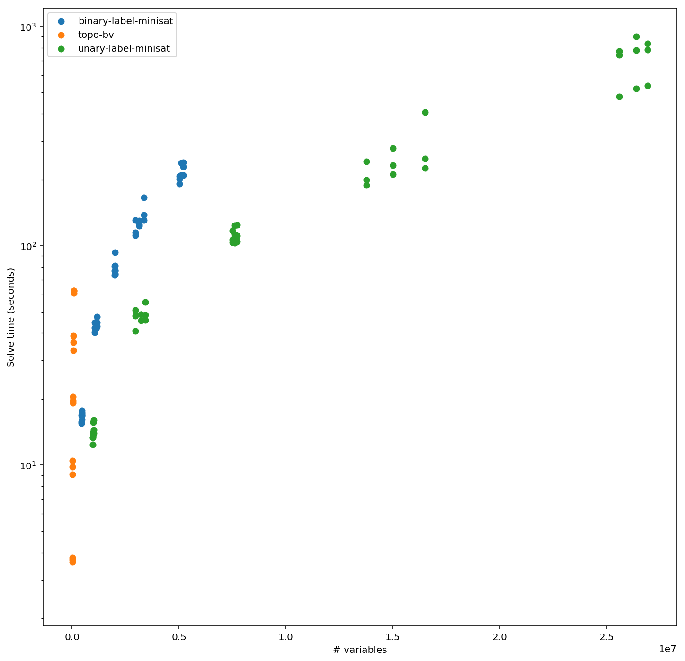

# CobraSAT

Using SAT/SMT solvers to check serializability of _black-box_ databases. 🐍

## About

This project compares the performance of different SAT/SMT encodings and solvers for verifying the serializability of black-box database.

This work is motivated by Cobra, described in Tan 2020 [0]. We explore alternative SAT/SMT encodings as a baseline for naively solving the serializability of database read-write histories.

## Experiments

We evaluated the performance of: 
- SAT binary labeling encoding of polygraph acyclicity, using Tseitin's transformation for encoding lexographic ordering [1]
  - Z3 (`*-z3`), Yices2 (`*-yices2`), and MiniSAT (`*-minisat`).
- SAT unary labeling encoding of polygraph acyclicity [1]
  - Z3 (`*-z3`), Yices2 (`*-yices2`), and MiniSAT (`*-minisat`).
- Transitive closure encoding (`tc1`, `tc3`) of polygraph acyclicity [1]. 
  - `tc` was encoded directly using Z3's `TransitiveClosure` relation [5].
- SMT topological ordering encoding of polygraph acyclicity [2].
  - `topo-bv` was using Z3's `BitVec` variables, and `topo-int` was using Z3's `Int` variables [5].
- Tree reduction encoding of polygraph acyclicity [2]
- Serializability consistency axioms (`axiom`) of database history [3].
- Direct MonoSAT encoding (`mono`) of polygraph acylicity [4].

We ran the experiments on benchmark with different ratios of random read-only and write-only transactions [0]. The read:write ratio workloads tested were 50:50, 75:25, and 90:10. The workloads are given as polygraph files (`.polyg`) consisting of node counts, edges, and constraints. Nodes correspond to transactions, and edges as write-read dependencies. Writes have been combined to reduce constraints in the polygraph. See section 2.3 and 3.1 in Tan 2020 [0].

Binary and unary labeling encodings were first compiled into DIMACS files by Python before being passed into solvers. `mono` was encoded directly into MonoSAT Python. All others were encoded directly into Z3 Python.

## Results

*For full graphs, see `exploration.ipynb`. Raw data is in `final.pckl`.*

### How do different encodings and solvers perform? How does runtime grow with larger workloads?

Runtime tends to grow exponentially with respect to node counts. `mono` is the clear performance winner, running significantly faster than all other encoding/solver pairs. The next fastest are `tc`, `topo-bv`, and `topo-int`, notably implemented most directly with Z3's higher level theories. `tree-bv` scales poorly with node count.

####  Plot of log of total runtime against number of nodes for 50:50 read-write ratio polygraphs



\**tree-bv for node counts over 200 excluded because of timeouts*

### How do different solvers perform with the same encoding?

Different encodings tend to perform similarly for different solvers. However, Yices2 scales much more effectively as node count grows for unary labeling.

#### Plot of runtime against number of nodes for 75:25 read-write ratio polygraphs, comparing solver backends



### What's the relationship between the number of SAT/SMT variables of an encoding and its solving time? 

We define variables in the standard way for SAT and as Z3 variables for SMT. We can see from the following plot that greater variable counts correlates with greater solve times, even when comparing encodings.

#### Plot of log solve time against number of SAT variables for all polygraphs



\**For this graph only, `binary-label-minisat` and `unary-label-minisat` include all binary labeling and unary labeling solvers, not just MiniSAT*

## Usage

Use `verify.py` to solve a given polygraph with a given encoding.

```
> python src/verify.py --help
```

Use `experiments.py` run the experiments, solving all the polygraphs in `polygraphs/workloads3` with every available encoding. The results are stored in the `results.pckl` [Pickle](https://docs.python.org/3/library/pickle.html) file as a dictionary.
```
> python src/experiments.py
```

To run the test suite:
```
> python src/test.py
```

## Dependencies

- Python 3.6+
- z3 4.8.9+
- minisat
- monosat
- yices2

You can install from source and place the resulting binary in `.venv/bin` if you are using `venv`.

## Bibliography

- [0] [Cobra: Making Transactional Key-Value Stores Verifiably Serializable (Tan, Zhao, Mu, and Walfish, 2020) (forthcoming)](http://naizhengtan.github.io/)
- [1] [On the Quest for an Acyclic Graph (Janota, Grigore, and Manquinho, 2017)](https://arxiv.org/abs/1708.01745)
- [2] [SAT modulo Graphs: Acyclicity (Gebser, Janhunen, and Rintanen, 2014)](https://link.springer.com/chapter/10.1007/978-3-319-11558-0_10)
- [3] [On the Complexity of Checking Transactional Consistency (Biswas and Enea, 2019)](https://arxiv.org/abs/1908.0450)
- [4] [SAT Modulo Monotonic Theories (Bayless, Bayless, Hoos, and Hu, 2015)](http://www.cs.ubc.ca/labs/isd/Projects/monosat/smmt.pdf)
- [5] [Z3: An Efficient SMT Solver (de Moura and Bjørner, 2008)](https://link.springer.com/content/pdf/10.1007%2F978-3-540-78800-3_24.pdf)

